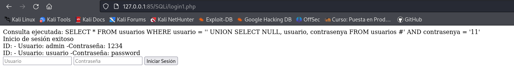

# Explotación y mitigación de SQL Inyection

Vamos a realizar diferentes pruebas sobre inyección SQl y su mitigación:

## Creando base de datos y tablas

Vamos a crear dentro de la base de datos de **PHPMyAdmin** de la pila LAMPP una base de datos con una tabla de usuarios que almacena el usuario y la contraseña:

También añadimos los usuarios *admin* y *usuario*


Para comprobar que esta creado correctamente accedemos a la base de datos y consultamos el contenido de la tabla de usuarios:


## Inyección SQL

Vamos a crear un fichero llamado [login1.php](./Recursos/login1.php) en nuestro servidor de apache ubicado en la carpeta *www*, que va a contener un pequeño formulario vulnerable a inyección SQL.

Una vez lo tenemos podemos acceder a el desde el navegador e introducir la siguiente instrucción sql:

```
' UNION SELECT NULL, usuario, contrasenya FROM usuarios #
```

Para mostrar los campos de usuario y contraseña de la table *usuarios*, el formulario nos muestra la información porque es vulnerable:



Ahora creamos un segundo fichero en el servidor apache llamado [login2.php](./Recursos/login2.php), con varias mejoras como escapar los caracteres especiales, utilizando la función ***addslashes()***.

Si vamos a este fichero en el navegador y volvemos a probar la inyección sql vemos que en este caso no funciona:


Las mejoras que contiene ***login2.php*** son:

+ Utilización de **$stmt->prepare()** y **bind_param()**, lo que previene inyección SQL.
+ Se verifica si **connect_error** devuelve un error antes de continuar.
+ Se escapan los caracteres especiales con la función **addslashes()**.
+ Se cierra la consulta **$stmt->close()** y la conexión **$conn->close()** correctamente.

Aunque que estas medidas mejoran la seguridad, aun tiene una serie de problemas:

+ Las contraseñas siguen almacenándose en texto plano, esto se podría solucionar almacenando las contraseñas con **password_hash()** y verificar con **password_verify()**.
+ Se sigue mostrando información detallada sobre los usuarios si la consulta es exitosa cuando debería iniciar una sesión en lugar de mostrar información del usuario.
+ No hay control de sesiones, es decir, no se establece una sesión segura (**session_start()**) después de una autenticación exitosa.

Teniendo en cuenta estos problemas vamos a crear el fichero [login3.php](./Recursos/login3.php) que ya contiene una serie de mejoras para los problemas que contenía:


Este fichero ya contiene tanto consultas preparadas (**prepare()** y **bind_param()**) como el escapado de salida con **htmlspecialchars()** y utiliza **password_hash()** y **password_verify()**.
